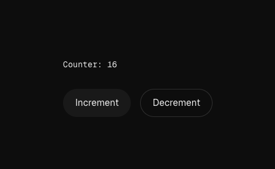

# Experiment `Single Cloudflare Worker` + NextJS + Durable Objects + OpenNext

This is an experiment to see how to run Durable Objects in the same worker as a Next.js app using `opennext-cloudflare`.
The idea is to have a single worker that serves both the Next.js app and the Durable Object.





> [!WARNING]
> This is a hack; it basically wraps the build output of `opennext-cloudflare` and adds a named export that points to the Durable Object class.
> You won't be able to use the development server, and you'll have to build the app every time you make changes to the Next.js app.
> This is based on one of the official Cloudflare Astro [templates](https://github.com/cloudflare/templates/blob/3ecfc97322d771cda2c2428cacdc1b5cf916e6e0/saas-admin-template/package.json#L57)

## Steps

1. Comment out the Durable Object in the `wrangler.jsonc` file

2. Build the Next.js app:

```bash
pnpm build:cf
```

3. Wrap the build output entry file:

```bash
pnpm add:durable-object
```

4. Uncomment the Durable Object in the `wrangler.jsonc` file

5. Run the worker:

```bash
pnpm wrangler dev
```
